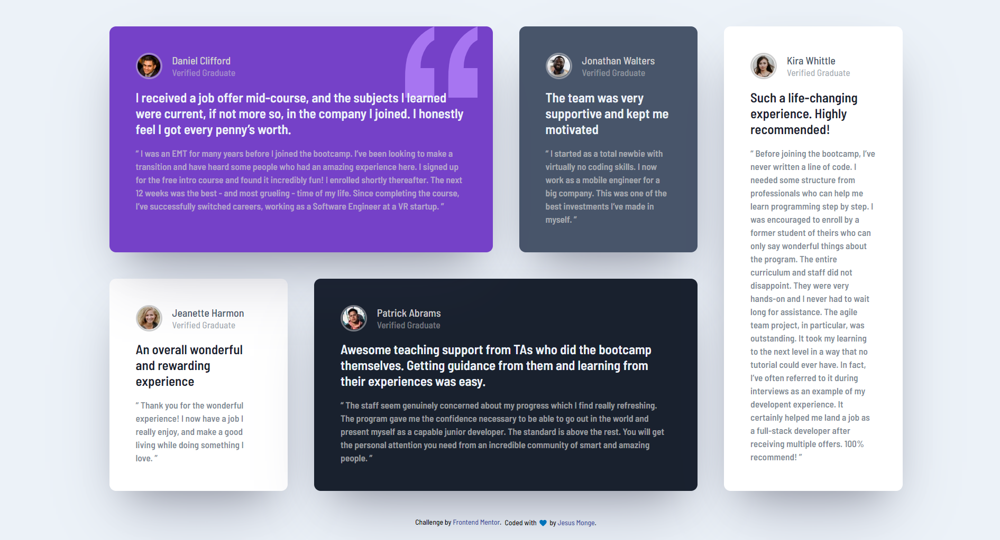

# Frontend Mentor - Testimonials grid section solution

This is a solution to the [Testimonials grid section challenge on Frontend Mentor](https://www.frontendmentor.io/challenges/testimonials-grid-section-Nnw6J7Un7). Frontend Mentor challenges help you improve your coding skills by building realistic projects.

## Table of contents

- [Overview](#overview)
  - [The challenge](#the-challenge)
  - [Screenshot](#screenshot)
  - [Links](#links)
- [My process](#my-process)
  - [Built with](#built-with)
  - [What I learned](#what-i-learned)
  - [Continued development](#continued-development)
  - [Useful resources](#useful-resources)
- [Author](#author)
- [Acknowledgments](#acknowledgments)

## Overview

### The challenge

Users should be able to:

- View the optimal layout for the site depending on their device's screen size

### Screenshot



### Links

- Solution URL: [Solution's-Code](https://github.com/jesusmongedev/testimonials-grid-section)
- Live Site URL: [Solution-GitHub-Pages](https://jesusmongedev.github.io/testimonials-grid-section/)

## My process

### Built with

- Semantic HTML5 markup
- CSS custom properties
- BEM naming convention
- Flexbox
- CSS Grid
- Mobile-first workflow
- [Build Setup](https://thinkdobecreate.com/articles/minimum-static-site-sass-setup/) - Minimum Static Site Setup with Sass
- [SASS](https://sass-lang.com/) - For styles

### What I learned

I learned that is important to analyze the design to see if we have similar elements and reuse it as much as we could. For example in this challenge testimonial card's shape were the same with some variations like: <code>background-color</code> / <code>boder-color</code> / and font <code>color</code>.

Here is when BEM naming convention comes to the rescue, using the syntax: <code>block\_\_element--modifier</code>, I focused on building the first card, use modifiers to set the quote icon for the first card. and other variations for the rest of cards.

Example using modifiers:

```html
<!-- Testimonial Card #1  -->
<!-- user-card--violet - modifier to set card's background-color -->
<article class="user-card user-card--violet">
  <!-- quotation svg background pattern just rendered in the first card -->
  
</article>
```

Bem + SASS is a great convination when styling, the ampersand (&) symbol is used to reference the parent selector in a nested rule, so css declarations' looks more clean, and you we can set custom properties like: fonts, colors ,and others, just using <code>$[variable-name]</code>

Example using SASS syntax:

```scss
// Variable declaration
$moderate-violet: hsl(263, 55%, 52%);
$very-dark-grayish-blue: hsl(217, 19%, 35%);
// using & to reference the parent selector and SASS variables
.user-card {
  color: $light-gray;
  border-radius: $bd-radius;
  box-shadow: $shadow-md;
  &--violet {
    background-color: $moderate-violet;
  }
```

### Continued development

SASS is great and I just know the basics of it, I would like to keep using it in future challenges, include more features like mixins, and more usefull features.

I have to practice more with static site npm projects, including SASS processing, runnig the final files through autopreFixer and cssnano. Defining the project structure, project scripts, succesfully build and deploy the project.

### Useful resources

- [Stop using an extension to compile Sass](https://www.youtube.com/watch?v=o4cECvhrBo8&t=1s&ab_channel=KevinPowell) - This helped me for setting up the project using SASS, autopreFixer and cssnano.
- [Stop using @import with Sass | @use and @forward explained](https://www.youtube.com/watch?v=CR-a8upNjJ0&t=449s) - This helped me for understanding new SASS features like <code>@forward @use</code>, folder structure, using components and abstracts' folder for SASS variables.
- [Minimum Static Site Setup with Sass](https://thinkdobecreate.com/articles/minimum-static-site-sass-setup/) - This is an amazing article which helped me understand the package.json template for a simple site build plus Sass.

## Author

- Website - [Jesus Monge](https://jmongedev.netlify.app/)
- Frontend Mentor - [@jesusmongedev](https://www.frontendmentor.io/profile/jesusmongedev)
- Twitter - [@yourusername](https://twitter.com/jmongedev)

## Acknowledgments

Practice is the key, I decided to solve this challenge, because I was reading documentation about CSS Grid, and I wanted to put in practice all the knowledge. This Testimonial Grid section was perfect. Thank you so much to Frontend Mentor and the hole comunity around them! 🔥
